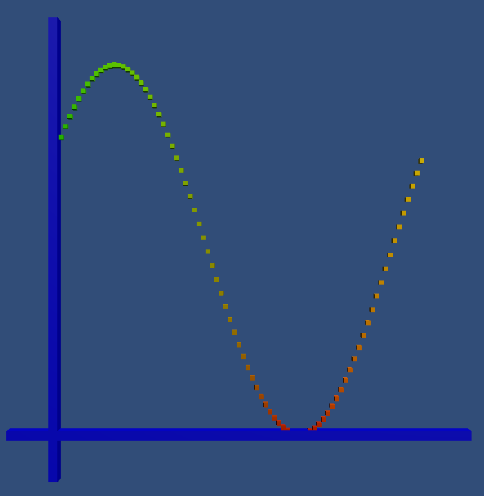
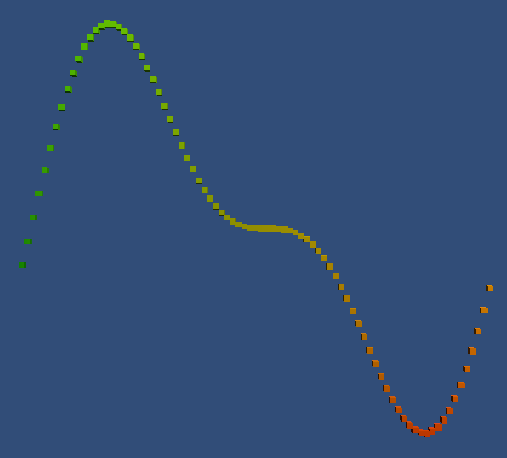
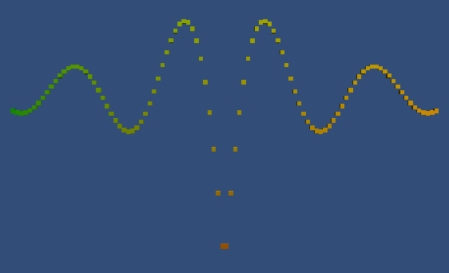
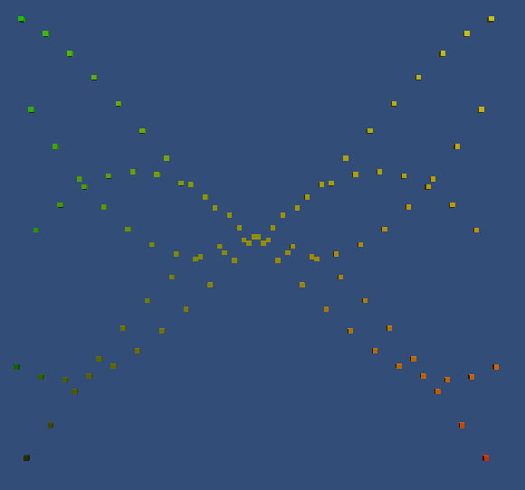
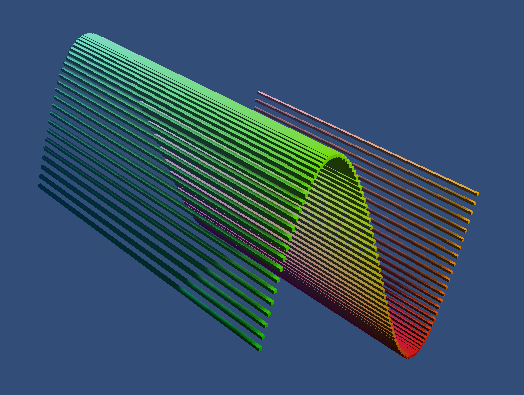
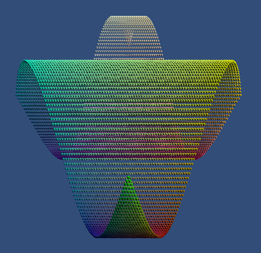
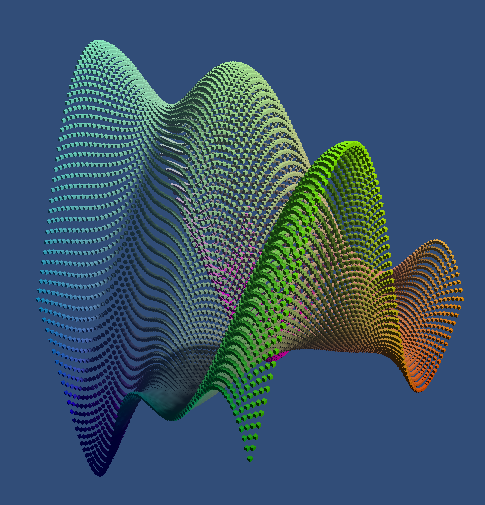
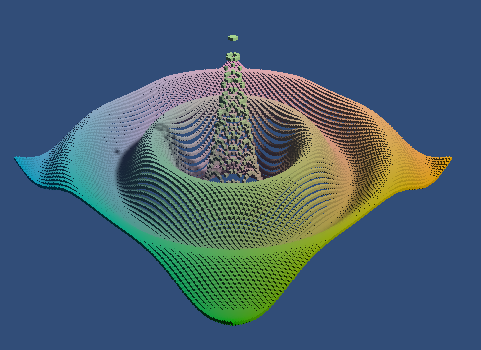
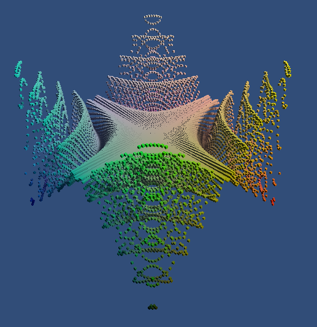

# Animated Graph

This project is a follow-along of
[Jasper Flick's Catlike Coding](https://catlikecoding.com/) Unity
[basics]https://catlikecoding.com/unity/tutorials/basics/) tutorials. This
repository covers the projects from Building a Graph all the way up to Organic
Variety.

## Part 1 - [Building a Graph](https://catlikecoding.com/unity/tutorials/basics/building-a-graph/)

The first part of the project entails creating a graph of a sinusoidal wave that
animates over time, instantiating points through a C# script and moving them on
an update loop. I've also added graphed axes as well. The project uses Universal
Render Pipeline (URP) for speed-ups as well.

## Part 2 - [Mathematical Surfaces](https://catlikecoding.com/unity/tutorials/basics/mathematical-surfaces/)

This section starts off with implementing other waves:

| Wave                       | Notes                                                                                                           |
| -------------------------- | --------------------------------------------------------------------------------------------------------------- |
|   | This wave is an addition of two sine waves.                                                                     |
|  | A more complicated addition of sinusoidal waves.                                                                |
|  | I created this interesting 'spider' periodic function on a whim. It devolves into aspiraling 3D effect quickly. |

Speaking of 3D...

| Wave                         | Notes                                                                 |
| ---------------------------- | --------------------------------------------------------------------- |
|       | The project's core functionality was easily extended to 3 dimensions. |
|  | Of course, the third dimension can be wrapped into the structure...   |
|  | Some interesting physical wave-like behavior can be seen here.        |
|     | I love how this one 'drops' in a physical sense.                      |
|          | Extending the 'spider' to 3 dimensions returned to crab.              |

The next portion moved on from the XZ plane into more interesting meshes and
surfaces.

# License TL;DR

This project is distributed under the MIT license. This is a paraphrasing of a
[short summary](https://tldrlegal.com/license/mit-license).

This license is a short, permissive software license. Basically, you can do
whatever you want with this software, as long as you include the original
copyright and license notice in any copy of this software/source.

## What you CAN do:

-   You may commercially use this project in any way, and profit off it or the
    code included in any way;
-   You may modify or make changes to this project in any way;
-   You may distribute this project, the compiled code, or its source in any
    way;
-   You may incorporate this work into something that has a more restrictive
    license in any way;
-   And you may use the work for private use.

## What you CANNOT do:

-   You may not hold me (the author) liable for anything that happens to this
    code as well as anything that this code accomplishes. The work is provided
    as-is.

## What you MUST do:

-   You must include the copyright notice in all copies or substantial uses of
    the work;
-   You must include the license notice in all copies or substantial uses of the
    work.

If you're feeling generous, give credit to me somewhere in your projects.
