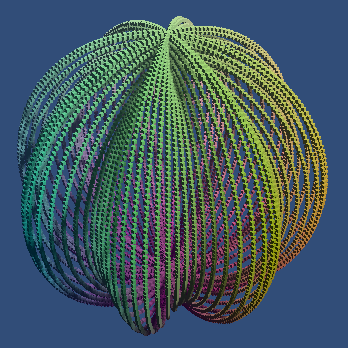

# Animated Graph

This project is a follow-along of
[Jasper Flick's Catlike Coding](https://catlikecoding.com/) Unity
[basics]https://catlikecoding.com/unity/tutorials/basics/) tutorials. This
repository covers the projects from Building a Graph all the way up to Organic
Variety.

## Part 1 - [Building a Graph](https://catlikecoding.com/unity/tutorials/basics/building-a-graph/)

The first part of the project entails creating a graph of a sinusoidal wave that
animates over time, instantiating points through a C# script and moving them on
an update loop. I've also added graphed axes as well. The project uses Universal
Render Pipeline (URP) for speed-ups as well.

## Part 2 - [Mathematical Surfaces](https://catlikecoding.com/unity/tutorials/basics/mathematical-surfaces/)

This section starts off with implementing other waves:

| Wave                       | Notes                                                                                                           |
| -------------------------- | --------------------------------------------------------------------------------------------------------------- |
|   | This wave is an addition of two sine waves.                                                                     |
|  | A more complicated addition of sinusoidal waves.                                                                |
|  | I created this interesting 'spider' periodic function on a whim. It devolves into aspiraling 3D effect quickly. |

Speaking of 3D...

| Wave                         | Notes                                                                 |
| ---------------------------- | --------------------------------------------------------------------- |
|       | The project's core functionality was easily extended to 3 dimensions. |
|  | Of course, the third dimension can be wrapped into the structure...   |
|  | Some interesting physical wave-like behavior can be seen here.        |
|     | I love how this one 'drops' in a physical sense.                      |
|          | Extending the 'spider' to 3 dimensions returned to crab.              |

The next portion moved on from the XZ plane into more interesting meshes and
surfaces with the UV coordinate space. This also allowed for a refactor of the
code in order to change resolution on the fly:

Finally, this part of the project ended with creating spheres and perturbing
their surfaces to make more complicated 3D objects. The following are a series
of the spherical implementations:

| Object                         | Notes                                                                 |
| ------------------------------ | --------------------------------------------------------------------- |
|          | A basic sphere surface.                                               |
|      | Adding some time variance to the sphere...                            |
|       | The sphere's surface can also have bands.                             |
|      | The bands can go in different directions...                           |
|  | Combining this vertical and horizontal nature yields a pretty visual. |

Toroidal shapes were also added:

| Object                         | Notes                                                                                          |
| ------------------------------ | ---------------------------------------------------------------------------------------------- |
|         | A basic self-intersecting spindle torus was step 1.                                            |
|       | Pulling the inner radius apart reveals a proper ring toroidal shape.                           |
|     | An artifact of the maths means decreasing the resolution results in these skeletal rings.      |
|      | Applying some funky time variance to the radii creates this beautiful optical illusion.        |
|  | Decreasing the resolution shows the star isn't spinning - It's just concentric stars rotating. |

At this point I went off on a bit of a tangent implementing some other
parametric surfaces.

| Surface                       | Notes                                                                                                                                                                                                                   |
| ----------------------------- | ----------------------------------------------------------------------------------------------------------------------------------------------------------------------------------------------------------------------- |
|      | This effect came about when looking for parametrized helixes.                                                                                                                                                           |
|          | Wikipedia had a listing of Surfaces of Revolution, where any univariate function could be passed in to create an interesting effect. I tried it with sinusoids and got this bifurcated slinky pattern.                  |
|          | Interestingly, trying this with cosine instead of sine combined the bifurcated pattern into concentric circles. Odd!                                                                                                    |
|          | I can't say I _didn't_ expect something strange here, but I definitely wasn't let down. This is with the tangent function.                                                                                              |
|          | Trying again with the secant function bifurcated the entire surface. Neat!                                                                                                                                              |
|        | I wanted to try applying tangents where they shouldn't be (by modifying the spiral star example). Needless to say... Nailed it.                                                                                         |
|        | Moving back to actual surfaces, this is the [Enneper surface](https://en.wikipedia.org/wiki/Enneper_surface). I found it through a rabbit hole of Weierstrass functions when I was playing with Surfaces of Revolution. |
|  | When trying to implement a Duplin Cyclide (Sort of a croissant shape?), I happened upon the hyperbolic variety. It's still pretty, so I figured I'd leave it in.                                                        |

## Part 3 - [Measuring Performance](https://catlikecoding.com/unity/tutorials/basics/measuring-performance/)

This section contains a series of interesting statistics. I think my
configuration of URP was inaccurate, however, as modifying particular parameters
and setting up debuggers didn't work properly.

However, the visual change in this section is the ability to morph the graph's
points to other functions automagically. It's a fairly beautiful experience, so
here's a long GIF:

## Part 4 - [Compute Shaders](https://catlikecoding.com/unity/tutorials/basics/compute-shaders/)

With a resolution value of 100 (as in the previous images), the program was able
to run at 100 FPS on my machine. This represents 10,000 points rendered, for a
total of 20,000 batches on URP (once for each point drawn, and once for casting
a shadow onto any other points). Increasing to 200 increases the batches to
80,000 (40,000 points and 40,000 shadows), and decreases my machine's
performance to 30 FPS.

Increasing to 500 resolution drops my FPS further down to 5 FPS, which is
practically unusable, only for a measly 250,000 points. However, I would prefer
to run millions of points simultaneously, if possible.

Currently, all points are sorted, batched, and calculated through C# scripts
running on the CPU. Offloading this work onto the GPU would significantly speed
up the task.

When swapping over materials, I realized that URP (while saving performance) is
extremely finicky to set up. However, I was successfully able to port functions
over to the GPU. As such, we can view them in much higher resolution:

| GIF                     | Notes                                                                                                                                                                                                            |
| ----------------------- | ---------------------------------------------------------------------------------------------------------------------------------------------------------------------------------------------------------------- |
|    | Running at a resolution of 10, or 100 cubes. This runs at ~1000 FPS on my machine's GPU.                                                                                                                         |
|   | Running at a resolution of 100, or 10,000 cubes, this runs at ~950 FPS on my machine's GPU. Clearly, the CPU is the bottleneck at high framerates.                                                               |
|  | Running at a resolution of 1000, or 1 million cubes, this runs at ~400 FPS on my machine's GPU. Beefy! The visuals are hampered by the small point size, though, giving the image an unfortunately 'dusty' look. |

Possibly the most annoying part of this implementation was working with all of
the `#pragma` directives and handling them. Since they had to be manually made,
and I had 18 unique functions, I had to manually declare all 324 functions (18
unique functions, and the remainder 'morphing' kernels from one wave to
another). Offloading the files into another compute shader file didn't seem to
work either, so I'm stuck having long (1000+ LoC) compute shader files if making
interesting tricks like these. In the future, I'll need to set up Python scripts
to manually generate this code.

# License TL;DR

This project is distributed under the MIT license. This is a paraphrasing of a
[short summary](https://tldrlegal.com/license/mit-license).

This license is a short, permissive software license. Basically, you can do
whatever you want with this software, as long as you include the original
copyright and license notice in any copy of this software/source.

## What you CAN do:

-   You may commercially use this project in any way, and profit off it or the
    code included in any way;
-   You may modify or make changes to this project in any way;
-   You may distribute this project, the compiled code, or its source in any
    way;
-   You may incorporate this work into something that has a more restrictive
    license in any way;
-   And you may use the work for private use.

## What you CANNOT do:

-   You may not hold me (the author) liable for anything that happens to this
    code as well as anything that this code accomplishes. The work is provided
    as-is.

## What you MUST do:

-   You must include the copyright notice in all copies or substantial uses of
    the work;
-   You must include the license notice in all copies or substantial uses of the
    work.

If you're feeling generous, give credit to me somewhere in your projects.
